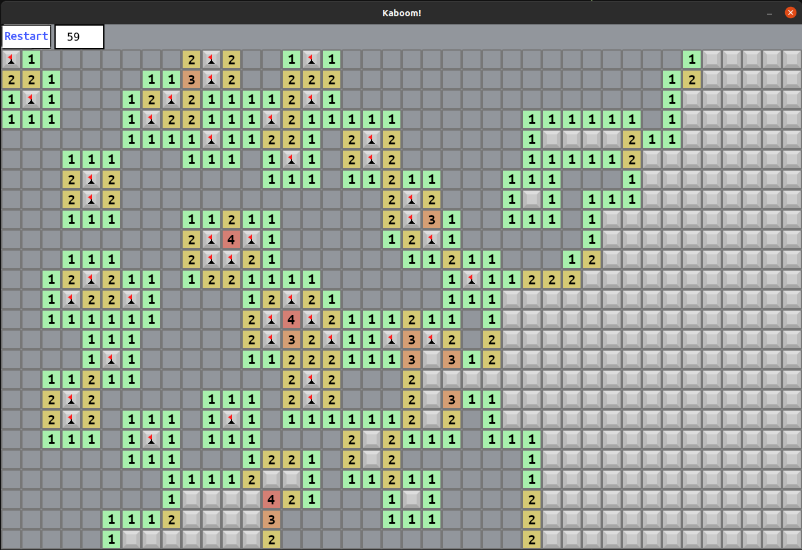

# Kaboom

### A Simple Minesweeper Clone Written in Rust

This project is mainly for demonstration purposes and to get my feet
wet with a "complete" project in Rust that I can hang my hat on.  I
normally write minesweeper clones in other languages when I want to
"kick the tires" and get a good feel.



### Building for Ubuntu

```bash
sudo apt install libsdl2-dev
sudo apt install libasound2-dev
cargo build --release
```
### OSX

```bash
brew install sdl2
cargo build --release
```
